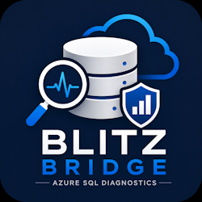
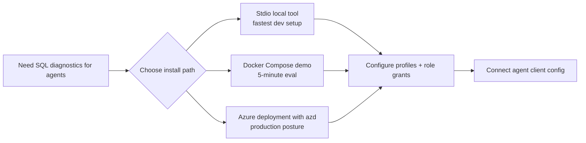

# Blitz Bridge

Blitz Bridge is a read-only MCP server for Azure SQL diagnostics: it lets agents run a tightly allowlisted Brent Ozar First Responder Kit (FRK) surface against preconfigured targets so teams can get fast, structured diagnostics without handing agents raw SQL credentials or arbitrary query access.



## Install

### As a local tool (stdio)

Use this when you want the quickest path for local or workstation use.

```bash
dotnet tool install -g BlitzBridge.McpServer
blitz-bridge --init-config
blitz-bridge --transport stdio --config path/to/profiles.json
```

`--init-config` creates a starter `profiles.json` and exits without starting the server.

- Default path (when `--config` is omitted):
  - Windows: `%APPDATA%\blitz-bridge\profiles.json`
  - Linux/macOS: `~/.config/blitz-bridge/profiles.json`
- Optional custom path:
  - `blitz-bridge --init-config --config ./profiles.beta.json`

Client config examples:

- `examples/client-configs/claude-desktop.json`
- `examples/client-configs/claude-code.json`
- `examples/client-configs/cursor.json`

### Try it in 5 minutes (Docker Compose)

Use this when you want to evaluate behavior quickly with the included sample environment.

```bash
cd samples/docker-compose-demo
cp .env.example .env
# Edit .env with your token/password values
docker compose up --build
```

See full walkthrough: `samples/docker-compose-demo/README.md`.

### Deploy to Azure (`azd`)

Use this for production-style deployment on Azure Container Apps with managed identity, Key Vault, and diagnostics.

```bash
azd env new
azd up
```

Deployment guide: `docs/deployment-azure.md`.

## Configure

### 1) Apply least-privilege SQL role grants

Run `docs/sql/blitz-bridge-role.sql` in the target database. It grants only:

- `EXECUTE` on allowed FRK procedures
- `VIEW SERVER STATE`
- `VIEW DATABASE STATE`

It also includes commented examples for managed identity and SQL auth user mapping.

### 2) Configure target profiles

Blitz Bridge uses profile-based target config:

```json
{
  "SqlTargets": {
    "Profiles": {
      "primary-sql-target": {
        "ConnectionString": "Server=tcp:...;Database=DBAtools;Authentication=Active Directory Default;Encrypt=True;ApplicationIntent=ReadOnly;",
        "AllowedDatabases": ["AppDb"],
        "AllowedProcedures": ["sp_Blitz", "sp_BlitzCache", "sp_BlitzFirst", "sp_BlitzIndex", "sp_BlitzLock", "sp_BlitzWho"],
        "Enabled": true,
        "CommandTimeoutSeconds": 60,
        "AiMode": 2
      }
    }
  }
}
```

## Connect an agent

Start with `examples/client-configs/`:

- `claude-desktop.json` (stdio)
- `claude-code.json` (stdio)
- `cursor.json` (stdio)
- `claude-desktop-hosted.json` (HTTP + bearer token)
- `python-mcp-client.py` (Python MCP SDK sample: list tools + call `azure_sql_target_capabilities`)

## Tool surface

- `azure_sql_target_capabilities`
- `azure_sql_blitz_cache`
- `azure_sql_blitz_index`
- `azure_sql_health_check`
- `azure_sql_current_incident`

## Security and responsibility boundaries

Blitz Bridge enforces read-only intent, allowlisted procedures, and profile-scoped access, but you own credential lifecycle, token distribution, and target authorization decisions.

See `SECURITY.md` for vulnerability reporting, guarantees, and non-goals.

## Additional docs

- Product requirements: `docs/PRD.md`
- Implementation plan/work tracking: `docs/implementation-work-items.md`
- Architecture overview: `docs/architecture.md`
- Azure deployment guide: `docs/deployment-azure.md`
- SQL least-privilege role script: `docs/sql/blitz-bridge-role.sql`
